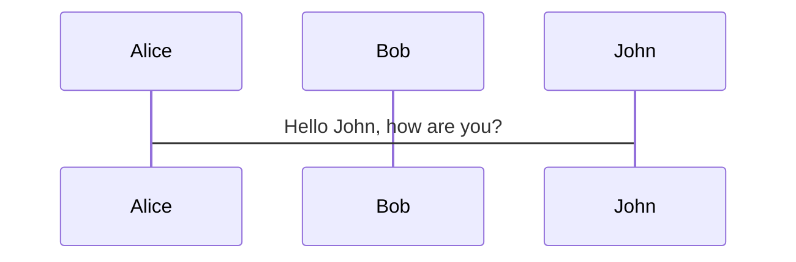

# UTILIZACION

## SINTAXIS
- Markdown <https://myst-parser.readthedocs.io/en/latest/syntax/syntax.html>
- reStructuredText <https://www.sphinx-doc.org/en/master/usage/restructuredtext/basics.html>

## BLOQUES

````{important}
ESTO ES ALGO IMPORTANTE QUE SE TIENE QUE VER

````

````{tip}
Esto es un consejo

````

````{warning}
Esto es una advertencia
````

````{note}
This text is **standard** _Markdown_
````

```{admonition} soy un bloque custom
Here is [markdown link syntax](https://jupyter.org)
```

## ECUACIONES
```{math}
   \begin{eqnarray}
      y    & = & ax^2 + bx + c \\
      f(x) & = & x^2 + 2xy + y^2
   \end{eqnarray}
```
## CODE FENCES

```sql
SELECT *
FROM
dbo.personas

```
## MERMAID
Mermaid tiene diragramas estandar como codigo https://mermaid-js.github.io/mermaid/#/

**ASI NO FUNCIONA**

**ASI FUNCIONA**

```{mermaid}

    sequenceDiagram
      participant Alice
      participant Bob
      Alice->John: Hello John, how are you?
```